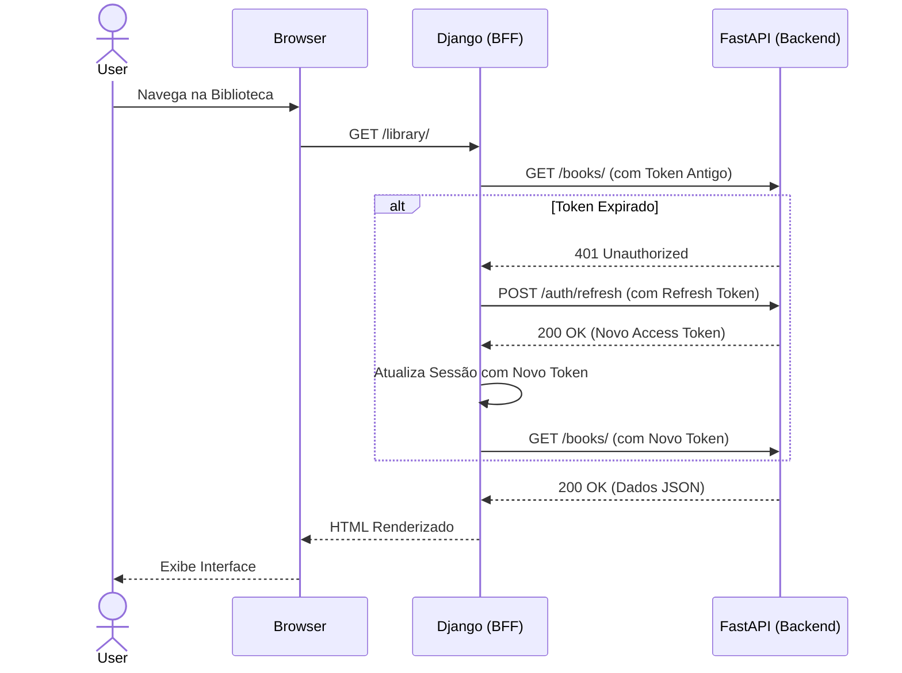

# 🎨 BookTrack - Frontend

> Interface de usuário e Backend-For-Frontend (BFF) para o ecossistema BookTrack.
> Construído com **Django**, renderizando HTML server-side enriquecido com **Vanilla JS (AJAX/Fetch)** para uma experiência dinâmica e de alta performance.

---

## 🏗️ Arquitetura (BFF - Backend For Frontend)

Diferente de uma SPA (React/Vue), este projeto utiliza o Django como um intermediário seguro entre o navegador do usuário e a API principal (FastAPI). 

O Django é responsável por:
1. Renderizar as telas principais (Templates HTML).
2. Gerenciar a sessão segura do usuário (armazenando os tokens JWT em `request.session`).
3. Interceptar requisições AJAX do cliente e repassá-las ao backend (Proxy).

### 🔐 Autenticação Transparente (`api_client`)
Uma das principais features técnicas deste frontend é a interceptação centralizada de requisições. 
Quando o token JWT de acesso expira, o FastAPI retorna `401 Unauthorized`. O cliente Django captura esse erro, faz uma chamada de *Refresh Token* automaticamente, atualiza a sessão e **refaz a requisição original** sem que o usuário perceba (Implementado na Task 8.12).



---

## ✨ Principais Funcionalidades de UX/UI

- **Lazy Loading Dinâmico:** Para aliviar o tráfego do servidor e do banco de dados, elementos pesados são carregados dinamicamente via AJAX:
  - **Citações (Quotes):** Implementação de paginação assíncrona (Task 15).
  - **Modais de Relacionamento:** Opções de *selects* para criar/editar relacionamentos só buscam os dados da API quando o usuário abre o modal (Perf-1/Perf-4).
- **Filtros e Busca Textual Hierárquica:** Interface de chips e *glassmorphism* integrados ao poder de busca e paginação da API.
- **Design System:** Uso massivo de CSS Vars para consistência (Dark mode native), ícones em SVG (Lucide) e foco intenso em tipografia (Task 16).

---

## 🛠️ Tecnologias Utilizadas

| Tecnologia | Propósito |
|:---|:---|
| **Django** | Framework Web (BFF e Templating) |
| **HTTPX** | Cliente HTTP moderno para comunicação com a API |
| **HTML5/CSS3** | Layout nativo com CSS Grid e Flexbox |
| **Vanilla JS** | Lógica de interação no DOM e Fetch API (sem frameworks pesados) |
| **Poetry** | Gerenciamento de dependências Python |

---

## 🚀 Como Executar Localmente

### Pré-requisitos
O [booktrack-backend](../booktrack-backend) deve estar rodando na porta `8080` (configurável via `.env`).

### Passo a Passo

```bash
# 1. Entre no diretório do frontend
cd booktrack-frontend

# 2. Instale as dependências via Poetry
poetry install

# 3. Configure as variáveis de ambiente
cp .env.example .env
# Certifique-se de que API_BASE_URL no .env aponta para a porta correta do backend

# 4. Inicie o servidor Django
poetry run python manage.py runserver 8000
```
*(Alternativamente, você pode rodar toda a stack pelo `docker-compose up` na raiz do projeto).*

---

## 👨‍💻 Autor

Desenvolvido para complementar a arquitetura em microsserviços do BookTrack.
